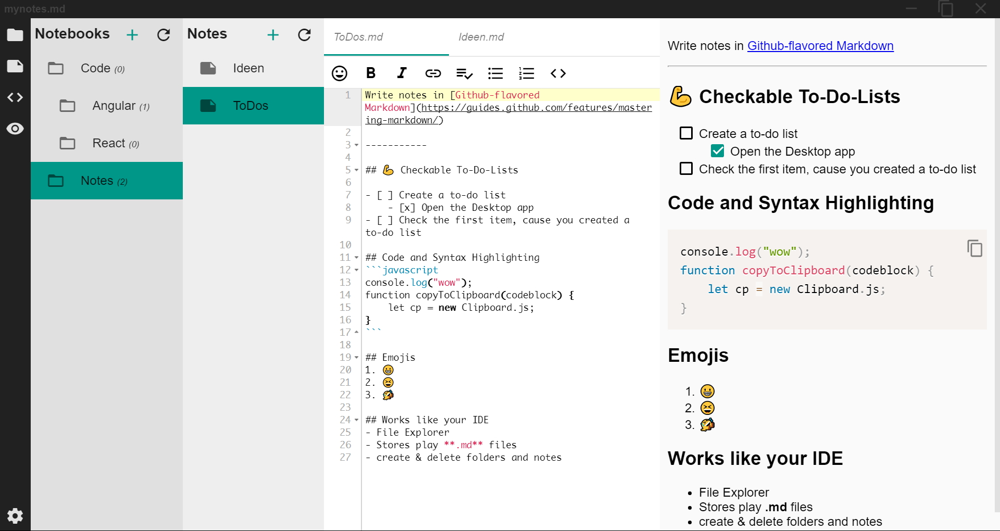
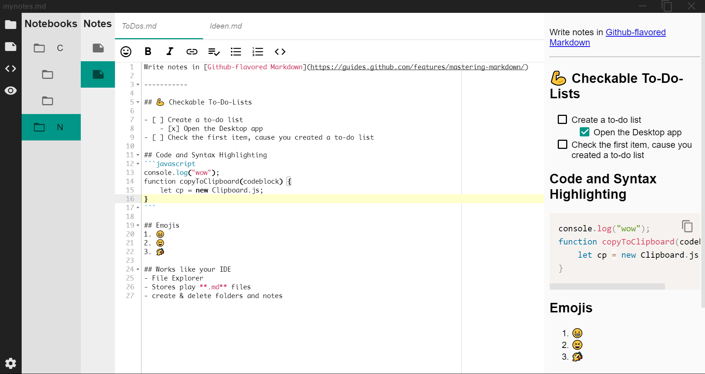
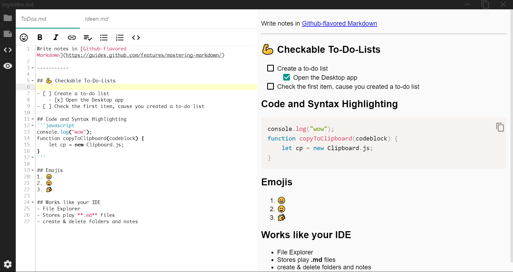
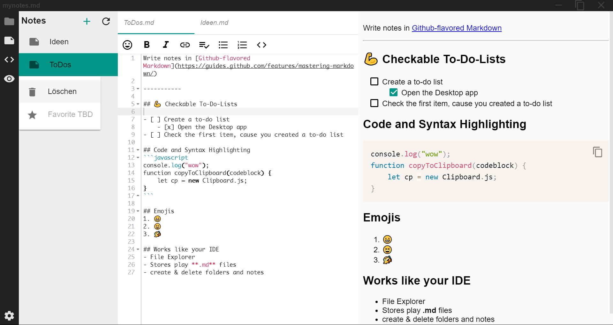

# Markdown Note Taking App
build with [marked.js](https://github.com/chjj/marked), [ace editor](https://ace.c9.io/) and [prism.js](http://prismjs.com/) based on [Maxime's boilerplate](https://github.com/maximegris/angular-electron)

## Description
MyNotes.md is a markdown note taking app, which takes a lokal directory with markdown files, so you can edit them in an nice and easy way without opening a new instance of your IDE.

## Installation and Setup
1. Download your OS-Version
2. Run it
3. Open Settings on the bottom left
4. Copy and Paste the absolute path to your markdown files

The directory can be any local folder. So you can use Dropbox and Google Drive too. E.g. "C:\Users\Clemens\Google Drive\Markdown-Notes"

**"Notebooks" are folders and "Notes" are markdown-files.** You can not put files in the root directory.

## Features
**1. Resizeable Elements**  
Drag an element to resize the viewable size of the element 

**2. Toggle visibility of elements**  
Focus on the tools you need

**3. Start where you left**  
All settings, like open files, size of elements and toggled elements are persistant and you can start right away.  
**4. Delete notebooks and notes**  
Right-Click an item to open the contextmenue

**5. Copy and Paste code**  
**6. Emojis**  
**7. Editor-Buttons for a quick insert**  
**8. Checkable list items**  
Click the checkbox on the rendered markdown to check an item. This will also change the raw markdown to "-[x] " or the opposite. **Note:** this feature searches for a string and replaces the third character before the string. So the square brackets have to follow by a space, e.g. "-[ ] ".

## Development
Checkout [Maxime's readme](https://github.com/maximegris/angular-electron) for the development flow.

## Contribution
Any Feedback and Contribution are much appreciated 😄  
Just create an issue or a pull request.

## License
[Apache2](./license.md)

